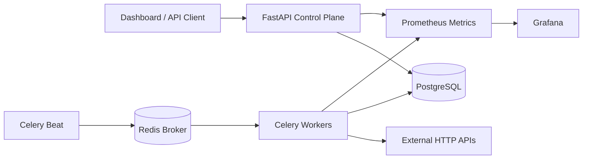

# IntegrationOps

**API reliability and integration monitoring platform for detecting, classifying, and recovering from third-party service failures.**

IntegrationOps is a backend-first engineering project built around a common production problem: applications depend on external APIs that can become slow, unavailable, rate-limited, misconfigured, or return unexpected contracts. The system runs scheduled probes outside the synchronous request path, persists check history, opens and resolves incidents from configurable thresholds, measures SLOs, and exposes its own operational telemetry.

## Why this project exists

A green application process does not mean the dependencies behind it are healthy. IntegrationOps focuses on the boundary between systems: network failures, authentication problems, upstream 5xx responses, rate limiting, latency regressions, and response-contract drift.

## Architecture



**Production stack:** Python 3.12, FastAPI, SQLAlchemy, PostgreSQL, Celery, Redis, Alembic, httpx, Prometheus, Grafana, Docker Compose, PyTest, GitHub Actions.

**Local mode:** FastAPI + SQLite + an in-process asynchronous scheduler, so the core system runs without infrastructure dependencies.

## Core behavior

- Scheduled and manually triggered HTTP health checks.
- Failure classification for `401/403`, `429`, `4xx`, `5xx`, timeouts, network errors, high latency, unsafe targets, and response-validation failures.
- `Retry-After`, response content type, and response size captured as structured check metadata.
- Idempotent execution IDs prevent duplicate health-check records during retries.
- Incident state machine: three consecutive failures open an incident and two recoveries resolve it by default.
- Per-integration availability and p95 latency SLO targets with error-budget remaining calculation.
- Optional Slack incident/resolution alerts; alert failure cannot roll back monitoring state.
- Encrypted integration headers when `INTEGRATION_SECRET_KEY` is configured.
- Production SSRF controls reject private, loopback, link-local, reserved, and cloud-metadata targets, including after DNS resolution.
- Prometheus metrics and an automatically provisioned Grafana dashboard.

## Failure demo

IntegrationOps includes a deterministic upstream simulator with these modes:

| Mode | Behavior |
|---|---|
| Healthy | HTTP 200 with expected JSON contract |
| High latency | Delayed HTTP 200 |
| Authentication | HTTP 401 |
| Rate limited | HTTP 429 + `Retry-After: 60` |
| Upstream failure | HTTP 503 |
| Contract drift | HTTP 200 with an unexpected JSON shape |

A full demo can be reproduced as:

```text
HEALTHY → 503 → 503 → 503 → INCIDENT OPEN
        → 200 → 200 → INCIDENT RESOLVED
```

See [`docs/demo-flow.md`](docs/demo-flow.md) for the interview/demo walkthrough and [`docs/architecture.md`](docs/architecture.md) for design rationale.

## Run locally

```bash
python -m venv .venv
# activate .venv
pip install -r requirements-core.txt
uvicorn app.main:app --reload
```

Open:

- Dashboard: `http://localhost:8000`
- OpenAPI/Swagger: `http://localhost:8000/docs`
- Prometheus metrics: `http://localhost:8000/metrics`

Local mode uses SQLite and the in-process scheduler. The built-in demo is created through a server-controlled endpoint; `DEMO_MODE=true` does **not** disable SSRF protection for arbitrary private targets.

## Run the distributed stack

Generate an encryption key before starting:

```bash
python -c "from cryptography.fernet import Fernet; print(Fernet.generate_key().decode())"
```

Set it as `INTEGRATION_SECRET_KEY`, then:

```bash
docker compose up --build
```

Services:

| Service | URL / role |
|---|---|
| FastAPI | `http://localhost:8000` |
| PostgreSQL | durable check/incident state |
| Redis | Celery task broker/backend |
| Celery Worker | concurrent health-check execution |
| Celery Beat | due-check dispatch |
| Prometheus | `http://localhost:9090` |
| Grafana | `http://localhost:3001` |

The API runs `alembic upgrade head` before startup. PostgreSQL and Redis health checks gate dependent services.

## API surface

```text
POST   /api/integrations
GET    /api/integrations
GET    /api/integrations/{id}
PATCH  /api/integrations/{id}
DELETE /api/integrations/{id}
POST   /api/integrations/{id}/check
GET    /api/integrations/{id}/checks
GET    /api/integrations/{id}/slo
GET    /api/incidents
GET    /api/overview
GET    /api/status
GET    /api/health
```

## Reliability design

**Why workers?** Monitoring external systems is I/O-bound and unpredictable. Health-check execution is kept out of the FastAPI request path so a slow dependency cannot consume API request capacity; workers can scale independently.

**Why PostgreSQL + Redis?** PostgreSQL holds durable/auditable history. Redis is intentionally limited to transient background-job infrastructure.

**Why thresholds?** A single transient timeout should not page an operator. Consecutive-failure/recovery thresholds act as a simple debounce policy and are configurable.

**Why idempotency?** Background jobs may be retried. A unique execution ID makes repeated execution safe at the persistence boundary.

**Why observe the monitor?** IntegrationOps exports metrics for check throughput, check duration, active incidents, and alert delivery so monitoring failures are visible too.

## Security model

Public monitoring products can become SSRF primitives if arbitrary URLs are accepted unchecked. In production, IntegrationOps validates target URLs and resolved addresses before probing and rejects loopback, RFC1918/private, link-local, reserved, multicast, and metadata endpoints. Redirect following is disabled during probes.

Sensitive request headers are encrypted at rest when `INTEGRATION_SECRET_KEY` is configured. The application derives the Fernet key from the deployment secret, so platform-generated high-entropy secrets work directly. The hosted portfolio configuration also sets `PUBLIC_WRITE_ENABLED=false`: visitors can exercise the controlled simulator, but cannot create arbitrary integrations or mutate general configuration.

## Testing

```bash
pytest -q
```

The suite covers HTTP failure classification, response-contract validation, rate-limit metadata, idempotent check execution, incident open/recovery logic, SLO reporting, encrypted secret storage, SSRF rejection, public-demo write restrictions, trusted demo routing, and a complete incident lifecycle through the orchestrator.

## Database migrations

```bash
alembic upgrade head
```

Alembic owns production schema evolution. `AUTO_CREATE_SCHEMA=true` exists only to make local SQLite development and tests frictionless.

## Deployment

`render.yaml` now defines the web API, Celery worker, Celery beat process, Render Key Value broker, and PostgreSQL dependency. Render generates the shared encryption secret, migrations run as a pre-deploy step, general writes are disabled on the public portfolio demo, and the built-in simulator remains usable. The repository intentionally does not commit credentials. Note that a long-lived hosted deployment can incur platform costs; choose the database/worker plans deliberately before provisioning.

## Repository layout

```text
app/
  api/             REST routes + deterministic failure simulator
  core/            settings, models, schemas, DB, security controls
  services/        checker, incidents, scheduler, alerts, metrics
  tasks.py         Celery jobs
alembic/            production database migrations
observability/
  prometheus/       scrape configuration
  grafana/          datasource + dashboard provisioning
tests/              unit + integration tests
docs/               architecture and demo walkthrough
```

## Scope

IntegrationOps deliberately stops short of becoming a Datadog clone. Kubernetes, Kafka, distributed tracing, billing, complex RBAC, and dozens of provider-specific connectors are outside the MVP. The project is designed to showcase backend architecture, asynchronous work, integration failure handling, persistence, observability, security, and operational reasoning with a compact codebase.

## License

MIT
