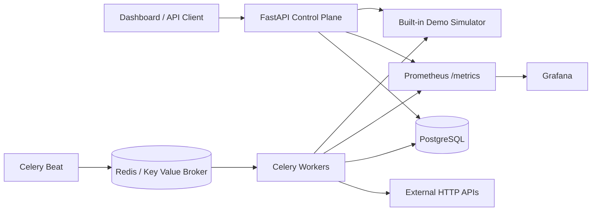

# Architecture

IntegrationOps separates synchronous control-plane traffic from asynchronous monitoring work.

## Design decisions

- **FastAPI is the control plane.** CRUD and read endpoints do not wait on scheduled network probes.
- **Celery workers execute health checks.** External-service latency and failure are isolated from API traffic and the worker pool can scale independently.
- **Redis / Render Key Value is transient infrastructure.** It brokers background jobs; durable monitoring history remains in PostgreSQL.
- **PostgreSQL is the system of record.** Integrations, check executions, incidents, SLO history, and alert events are relational and auditable.
- **Execution IDs make checks idempotent.** Retried work does not create duplicate monitoring records.
- **Incident thresholds debounce transient faults.** Three consecutive failures open an incident; two healthy/degraded checks resolve it by default.
- **SSRF controls protect public deployments.** User-created probes reject private, loopback, link-local, reserved, and cloud-metadata targets after hostname/IP validation and DNS resolution. Redirect following is disabled.
- **The demo exception is narrow.** `DEMO_MODE` does not globally permit private targets. Only the exact server-controlled `Demo Upstream` endpoint can use a private address, which is necessary for Docker workers to reach the API service by its Compose hostname.
- **Hosted demo writes are restricted.** `PUBLIC_WRITE_ENABLED=false` prevents anonymous visitors from creating arbitrary integrations while still allowing the built-in demo flow.
- **Prometheus/Grafana observe the observer.** IntegrationOps exposes its own check throughput, p95 execution duration, active incidents, and alert metrics.
